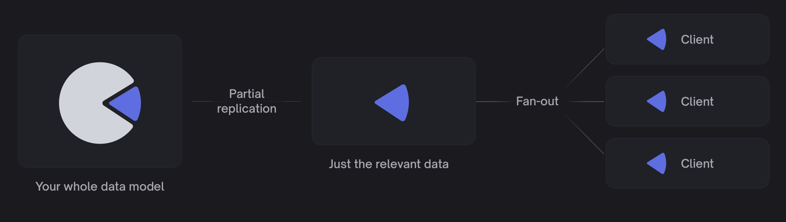

## General

Electric is a [Postgres sync engine](https://electric-sql.com). It syncs data out of Postgres into anything you like.

Electric handles read-path sync, [partial replication](https://electric-sql.com/docs/guides/shapes), [fan-out](https://electric-sql.com/docs/api/http#caching), and [data delivery](https://electric-sql.com/docs/api/http). So you can build fast, modern software on live, local data &mdash; without rolling your own sync engine.

Electric works with [any Postgres](https://electric-sql.com/docs/guides/deployment#_1-running-postgres), [any data model](https://electric-sql.com/docs/guides/deployment#data-model-compatibility) and [any web framework](https://electric-sql.com/docs/guides/client-development). Data syncs [over HTTP](https://electric-sql.com/docs/api/http), allowing you to use your existing API and web stack to handle auth, writes and any arbitrary stream transformation. Because it's HTTP, it works with standard CDNs, allowing you to easily scale out low-latancy data delivery to [millions of concurrent clients](https://electric-sql.com/docs/reference/benchmarks#cloud).

## The Story

Electric was founded by [James Arthur and Valter Balegas](https://electric-sql.com/about/team), in collaboration with two of the inventors of CRDTs, Marc Shapiro and Nuno Preguiça; and Annette Bieniusa, a world expert on distributed database technology. Kyle Mathews joined as the third founder in 2024, having previously built and sold Gatsby to Netlify.

The original vision for Electric was to build on [research advances in eventually consistent database technology](https://electric-sql.com/docs/reference/literature) to build a next-generation geo-distributed database for the "AP" side of the CAP theorem. The team quickly pivoted to using the same techniques to provide a replication layer for existing open source databases and then focused on building an end-to-end local-first software stack as the killer app for this.

When Kyle joined, he led a [clean re-write](https://electric-sql.com/blog/2024/07/17/electric-next) to simplify Electric and build a core system that worked well for read-path sync. This pushed a lot of complexity out of scope which, combined with the experience the team had gained building previous iterations, allowed Electric to quickly build a highly-scalable read-path sync engine based based on a [new HTTP protocol](https://electric-sql.com/docs/api/http).

This new system [hit BETA](https://electric-sql.com/blog/2024/12/10/electric-beta-release) in December 2025 and [GA with a 1.0 release](https://electric-sql.com/blog/2025/03/17/electricsql-1.0-released) on the 17th March 2025.

Electric is a funded startup, backed by VCs including [Spark Captial](https://www.sparkcapital.com), [Lunar Ventures](https://www.lunar.vc) and [StepFunction](https://www.stepfunction.vc). They are also backed by a range of leading database and devtools founders, including the founders of Supabase, Motherduck, Cockroach, Xata, Nile, Heroku and Ink & Switch and leading angels like Theo Brown and Chris Riccomini.

The core technology of Electric is developed in Elixir and the company is also backed by José Valim, the creator of Elixir and integrated into Phoenix, the main Elixir web framework as [Phoenix.Sync](https://hexdocs.pm/phoenix_sync). Other notable framework integrations include [LiveStore](LiveStore.dev) and [@TanStack/optimistic](https://github.com/TanStack/optimistic).

Electric also develop the popular [PGlite](https://pglite.dev) project, a lightweight embeddable Postgres database that can be used in the browser. The two products (the Electric sync engine and the PGlite database) can be used together or independently and are now built into leading developer tools such as Google's [Firebase Tools](https://www.npmjs.com/package/firebase-tools?activeTab=dependencies) and Supabase's AI project builder [database.build](https://database.build).

## Resources

Electric is an open source project published on GitHub as [electric-sql/electric](https://github.com/electric-sql/electric). Everything is Apache 2.0 licensed. There's an open Discord community at [discord.electric-sql.com](https://discord.electric-sql.com) and the PGlite project has a separate website at [pglite.dev](https://pglite.dev).

- [Website](https://electric-sql.com)
- [Docs](https://electric-sql.com/docs/intro)
- [GitHub](https://github.com/electric-sql/electric)
- [Discord](https://discord.electric-sql.com)
- [Bluesky](https://bsky.app/profile/electric-sql.com)
- [PGlite](https://pglite.dev)
